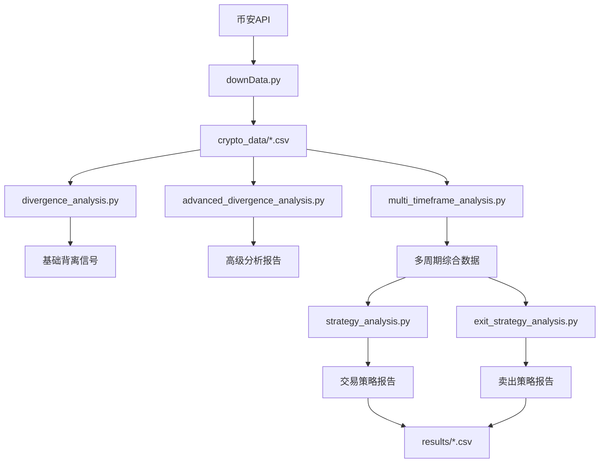

# 📁 项目结构说明

## 🏗️ 整体架构

```
crypto/
├── 📁 src/                       # 源代码目录
│   ├── 📁 data_collection/       # 数据收集模块
│   ├── 📁 analysis/              # 分析模块
│   └── 📁 strategies/            # 交易策略模块
├── 📁 crypto_data/               # 原始数据文件
├── 📁 results/                   # 分析结果
├── 📁 config/                    # 配置文件
├── 📁 docs/                      # 文档
├── 📁 venv/                      # 虚拟环境
├── 📄 run.py                     # 项目管理脚本
└── 📄 README.md                  # 项目说明
```

## 📦 模块详细说明

### 🔧 数据收集模块 (`src/data_collection/`)

| 文件 | 功能 | 主要类/函数 |
|------|------|-------------|
| `downData.py` | 币安API数据下载 | `download_binance_data()` |

**功能特点：**
- 支持多个时间周期（1h, 2h, 4h, 8h, 12h, 1d, 3d, 1w）
- 增量更新机制
- 自动时区转换（UTC → 北京时间）
- 数据去重和异常处理

### 📊 分析模块 (`src/analysis/`)

| 文件 | 功能 | 主要类/函数 |
|------|------|-------------|
| `divergence_analysis.py` | 基础背离分析 | `DivergenceAnalyzer` |
| `advanced_divergence_analysis.py` | 高级分析和回测 | `AdvancedDivergenceAnalyzer` |
| `multi_timeframe_analysis.py` | 多周期分析 | `MultiTimeframeAnalyzer` |

**核心算法：**
- KDJ指标计算（K、D、J值）
- 背离信号识别
- 信号强度分级
- 历史回测验证

### 💰 策略模块 (`src/strategies/`)

| 文件 | 功能 | 主要类/函数 |
|------|------|-------------|
| `strategy_analysis.py` | 交易策略分析 | `analyze_trading_strategies()` |
| `exit_strategy_analysis.py` | 卖出策略分析 | `analyze_exit_strategies()` |

**策略类型：**
- 底部背离买入策略
- 多周期共振策略
- 强信号精准策略
- 价格区间差异化策略
- 综合智能卖出策略

## 📋 数据流程



## 🎯 使用流程

### 1️⃣ 环境准备
```bash
python run.py --setup
```

### 2️⃣ 数据收集
```bash
python run.py --download
```

### 3️⃣ 分析执行
```bash
# 基础分析
python run.py --basic

# 高级分析
python run.py --advanced

# 多周期分析
python run.py --multi
```

### 4️⃣ 策略分析
```bash
# 交易策略
python run.py --strategy

# 卖出策略
python run.py --exit
```

### 5️⃣ 完整流程
```bash
python run.py --full
```

## 🔧 配置文件

### `config/requirements.txt`
```
pandas==2.2.3
requests==2.32.3
pytz==2025.2
```

### `config/.gitignore`
- 忽略Python缓存文件
- 忽略虚拟环境
- 忽略系统文件
- 保留重要数据文件

## 📊 输出文件

### 数据文件 (`crypto_data/`)
- `BTCUSDT_1h.csv` - 1小时K线数据
- `BTCUSDT_1d.csv` - 日线数据
- 其他时间周期数据...

### 结果文件 (`results/`)
- `所有周期背离数据_YYYYMMDD_HHMMSS.csv` - 综合分析结果
- 各种专项分析报告CSV文件

## 🚀 扩展开发

### 添加新的时间周期
修改 `src/data_collection/downData.py`：
```python
intervals = ['15m', '30m', '1h', '2h', '4h', ...]
```

### 添加新的技术指标
在 `src/analysis/divergence_analysis.py` 中扩展：
```python
def calculate_rsi(self, data, period=14):
    # RSI计算逻辑
    pass
```

### 添加新的交易策略
在 `src/strategies/` 目录下创建新文件：
```python
def new_strategy_analysis(df):
    # 新策略逻辑
    pass
```

## ⚠️ 注意事项

1. **数据依赖**：确保网络连接稳定
2. **计算资源**：大量数据分析需要足够内存
3. **文件权限**：确保对数据目录有读写权限
4. **时区问题**：所有时间都转换为北京时间
5. **API限制**：注意币安API的请求频率限制

## 📝 更新日志

| 版本 | 日期 | 更新内容 |
|------|------|----------|
| 1.0.0 | 2025-05-29 | 初始版本，完整功能实现 |

---

**项目维护**：定期更新依赖包，保持代码风格一致性 